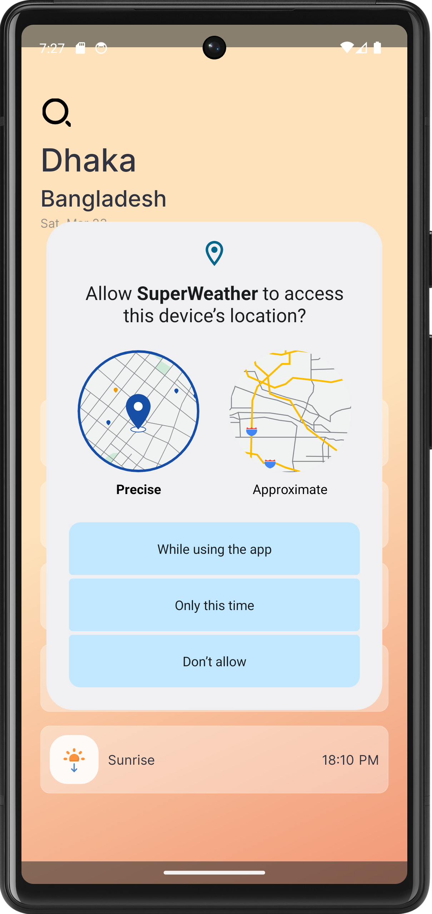
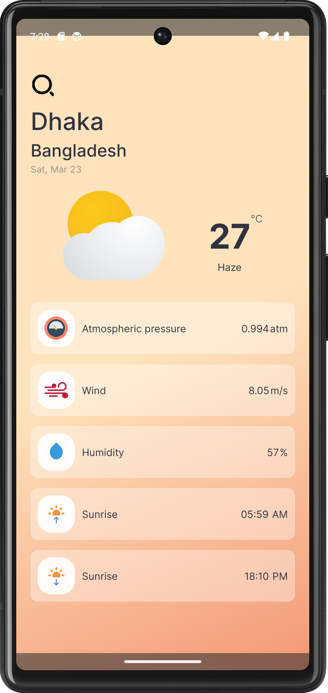
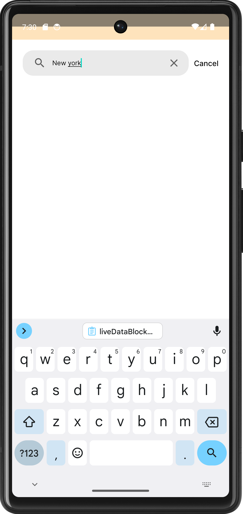
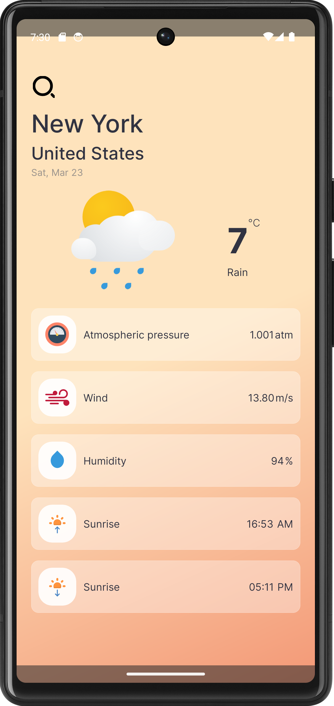

# SuperWeather
SuperWeather is an android application that shows weather information from openweathermap api &amp; their details 

## Introduction
This is a demo application built with the goal to create a weather forecasting application based on the MVVM architectural pattern using [OPENWEATHEMAP](https://openweathermap.org/)
according to the instruction of the programming test.

See below for more information.

## Technologies & Architecture 

#### Technologies
* Android, Kotlin
* [OPENWEATHERMAP](https://openweathermap.org/)
* [Retrofit HTTP Client](https://square.github.io/retrofit/) 
* [OkHttp](https://square.github.io/okhttp/) - Interceptor

#### Architecture
**Model-View-ViewModel (MVVM)**

#### Architecture Components
[ViewModel](https://developer.android.com/topic/libraries/architecture/viewmodel),
[LiveData](https://developer.android.com/topic/libraries/architecture/livedata),
[Coroutine](https://kotlinlang.org/docs/coroutines-overview.html),
[DataBinding](https://developer.android.com/topic/libraries/data-binding), 
[Navigation](https://developer.android.com/guide/navigation/)

## Features
- **Retrieve weather data based on the user's current location using GPS** 
- **Search options for user to search a city and get weather data for that location**
- **Internet connectivity and error handling in a clean code way**  

## Screenshots

   &emsp; 
   &emsp; 
   &emsp;
  
  

https://github.com/Sohanur-Rahman642/SuperWeather/assets/44776605/1d2cf9b6-59b3-420c-b890-b544538b5286

## Setup

#### Requirements

#### The Open Weather Map API
1. Sign up and retrieve a API key from [The Open Weather Map API](https://openweathermap.org/api) 

#### Project
1. Download and open the project in Android Studio
2. Edit the file local.properties and add the line: open_weather_map_api_key="YOUR_KEY"
3. Connect your Android phone or use the emulator 
4. Build and Run to start the application
